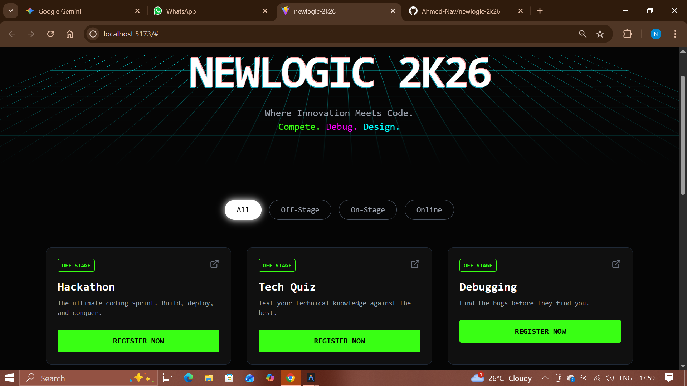

# ⚡ NewLogic 2K26


> **Where Innovation Meets Code.**
> The official event portal for the National Level Technical Symposium organized by the Department of Computer Science, The New College.

---

## 🚀 Live Demo

**[Click here to view the live site](https://newlogic-2k26.vercel.app)** _(Replace this link with your actual Vercel link after deployment)_

---

## 📸 Screenshots

![Dashboard Preview]



---

## ✨ Key Features

- **Cyberpunk Aesthetic:** Custom "Neon" design system with glowing shadows and borders.
- **Interactive Animations:** High-performance animations using `Framer Motion` (Glitch text, hover states, entrance effects).
- **3D Environment:** CSS-only 3D perspective grid background.
- **Dynamic Filtering:** Instant filtering for "On-Stage", "Off-Stage", and "Online" events.
- **Responsive Design:** Fully optimized for mobile, tablet, and desktop views.

---

## 🛠️ Tech Stack

- **Framework:** [React](https://react.dev/) (via Vite)
- **Styling:** [Tailwind CSS v3](https://tailwindcss.com/)
- **Animation:** [Framer Motion](https://www.framer.com/motion/)
- **Icons:** [Lucide React](https://lucide.dev/)
- **Deployment:** [Vercel](https://vercel.com/)

---

## ⚙️ Installation & Setup

If you want to run this project locally:

```bash
# 1. Clone the repository
git clone [https://github.com/Ahmed-Nav/newlogic-2k26.git](https://github.com/Ahmed-Nav/newlogic-2k26.git)

# 2. Enter the directory
cd newlogic-2k26

# 3. Install dependencies
npm install

# 4. Start the development server
npm run dev
```
